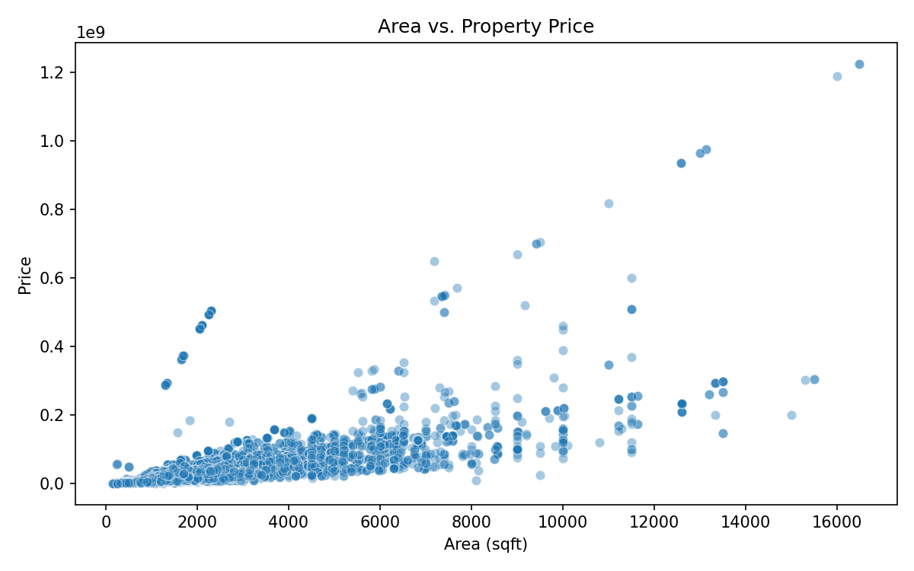
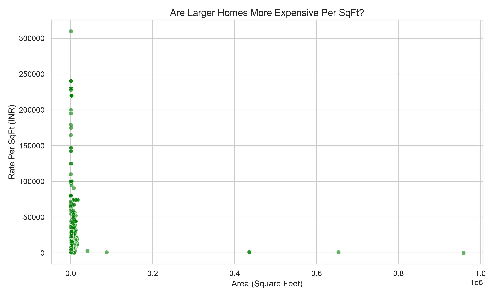
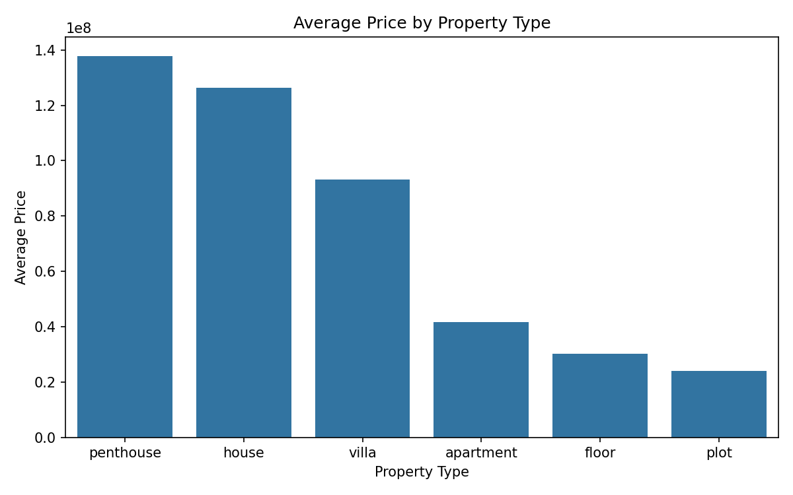

# Gurgaon Real Estate Market Analysis

## Project Overview
This project analyzes residential property data in Gurgaon to extract data-backed insights for homebuyers, investors, and real estate developers. Through Exploratory Data Analysis (EDA), this project evaluates pricing trends, premium localities, and the financial impact of variables such as RERA approval, property type, and builder reputation.

## Key Visualizations & Insights

### 1. Area vs. Property Price
*Visualizing the direct correlation between property size and overall cost.*

### 2. Economies of Scale: Area vs. Rate Per SqFt
*Analyzing whether larger homes are more expensive per square foot. The data indicates that rate per square foot does not strictly increase with area.*

### 3. Average Price by Property Type
*Comparing average market prices across Apartments, Builder Floors, and Independent Plots.*

## Summary of Business Findings
* **Location Premium:** Specific premium localities consistently command higher average prices and rates per square foot.
* **Trust & Convenience:** Ready-to-move and RERA-approved properties reflect a price premium, indicating buyer preference for immediate possession and regulatory security.
* **Builder Brand Value:** Properties constructed by top-tier builders are priced significantly higher.
* **Property Type Economics:** Apartments generally yield a higher rate per square foot compared to independent plots and builder floors.
* **Economies of Scale:** Larger homes are not always more expensive per square foot, showing a tapering effect on price as area increases.

## Tools & Technologies
* **Language:** Python
* **Data Manipulation:** Pandas
* **Data Visualization:** Matplotlib, Seaborn

## Dataset Details
The dataset includes pricing, area, BHK configuration, property type, builder details, and RERA approval status across multiple sectors of Gurgaon.
* **Source:** [Kaggle - Gurgaon Real Estate Dataset](https://www.kaggle.com/datasets/nikhilmehrahr26/gurgaon-real-estate-dataset)

## How to Run the Project
1. Clone this repository to your local machine.
2. Ensure Python is installed.
3. Install the required dependencies: `pip install -r requirements.txt`
4. Run the analysis script: `python main.py`